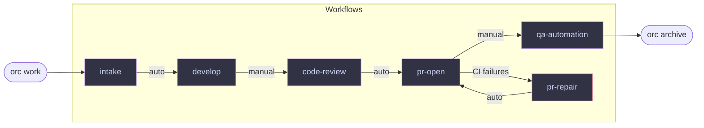

# orc

Agentic workspace orchestrator. A Go CLI that scaffolds and manages a filesystem-based
workspace for carrying feature work across agents, repos, and sessions.

```
⠀⠀⠀⠀⠀⠀⠀⠀⠀⠀⠀⠀⠀⠀⢀⡀⠀⠀⠀⠀⠀⠀⠀⠀⠀⠀⠀⠀⠀⠀
⠀⠀⠀⠀⠀⠀⠀⠀⠀⠀⠀⠀⠀⢠⣿⣿⡄⠀⠀⠀⠀⠀⠀⠀⠀⠀⠀⠀⠀⠀
⠀⠀⠀⠀⠀⠀⠀⠀⠀⣀⣤⣶⣧⣄⣉⣉⣠⣼⣶⣤⣀⠀⠀⠀⠀⠀⠀⠀⠀⠀
⠀⠀⠀⠀⠀⠀⠀⢰⣿⣿⣿⣿⡿⣿⣿⣿⣿⢿⣿⣿⣿⣿⡆⠀⠀⠀⠀⠀⠀⠀
⠀⠀⠀⠀⠀⠀⠀⣼⣤⣤⣈⠙⠳⢄⣉⣋⡡⠞⠋⣁⣤⣤⣧⠀⠀⠀⠀⠀⠀⠀
⠀⢲⣶⣤⣄⡀⢀⣿⣄⠙⠿⣿⣦⣤⡿⢿⣤⣴⣿⠿⠋⣠⣿⠀⢀⣠⣤⣶⡖⠀
⠀⠀⠙⣿⠛⠇⢸⣿⣿⡟⠀⡄⢉⠉⢀⡀⠉⡉⢠⠀⢻⣿⣿⡇⠸⠛⣿⠋⠀⠀
⠀⠀⠀⠘⣷⠀⢸⡏⠻⣿⣤⣤⠂⣠⣿⣿⣄⠑⣤⣤⣿⠟⢹⡇⠀⣾⠃⠀⠀⠀
⠀⠀⠀⠀⠘⠀⢸⣿⡀⢀⠙⠻⢦⣌⣉⣉⣡⡴⠟⠋⡀⢀⣿⡇⠀⠃⠀⠀⠀⠀
⠀⠀⠀⠀⠀⠀⢸⣿⣧⠈⠛⠂⠀⠉⠛⠛⠉⠀⠐⠛⠁⣼⣿⡇⠀⠀⠀⠀⠀⠀
⠀⠀⠀⠀⠀⠀⠸⣏⠀⣤⡶⠖⠛⠋⠉⠉⠙⠛⠲⢶⣤⠀⣹⠇⠀⠀⠀⠀⠀⠀
⠀⠀⠀⠀⠀⠀⠀⠀⠀⢹⣿⣶⣿⣿⣿⣿⣿⣿⣶⣿⡏⠀⠀⠀⠀⠀⠀⠀⠀⠀
⠀⠀⠀⠀⠀⠀⠀⠀⠀⠈⠉⠉⠉⠛⠛⠛⠛⠉⠉⠉⠁⠀⠀⠀⠀⠀⠀⠀⠀⠀

orc · workspace orchestrator
```

## What it is

Agents lose context between sessions. `orc` solves this by keeping all state in
files — `STATE.yaml`, markdown docs — not in memory or running services.

The workspace is the source of truth. Agents read it to know what to do next.
`orc` reads it to tell you (or an agent) exactly which worker should run and
what command to use. Policy lives in `RULES.md`, `AGENTS.md`, and worker
definitions — not in code.

The quality of the system depends on the quality of the workflow docs. A
well-written `WORKFLOW.md` has clear exit criteria, explicit output definitions,
unambiguous signals agents can read (like a `verdict:` line), and exact commands
for every outcome. The sample workflows are a starting point — tune them to your
stack, your review standards, and your team's process. They're just markdown files:
edit one and the next agent session picks up the new instructions immediately.

Works equally well with **Claude** and **Codex**. Every decision that could
couple the workspace to a single agent product is avoided by design.

## Install

```bash
go install github.com/cengebretson/orc/cmd/orc@latest
```

Or build from source:

```bash
git clone git@github.com:cengebretson/orc.git
cd orc
go build -o orc ./cmd/orc/...
```

## Getting started

### 1. Scaffold a workspace

```bash
orc init --workspace ~/my-workspace --with-sample-workers
```

### 2. Run setup

Let an agent configure the workspace for your ticketing system, source control,
and preferred agents:

```bash
cd ~/my-workspace
claude "Read SETUP.md and follow the setup instructions"
# or: codex "Read SETUP.md and follow the setup instructions"
```

The agent will ask about your ticket system (Jira, GitHub Issues, etc.), repos,
and which Claude/Codex model to use for each stage. It creates worker files and
updates `workflows/intake/WORKFLOW.md` with the right source system instructions.

### 3. Check health

```bash
orc health
```

### 4. Start working on a ticket

```bash
orc work FLYWL-123
```

This creates `features/FLYWL-123/` and immediately prints the intake agent
launch command. Run it — the agent fetches the ticket, populates `TICKET.md`,
`SPEC.md`, and `PLAN.md`, and updates `STATE.yaml` to `status: ready`.

### 5. Continue work

```bash
orc next FLYWL-123
```

Launches the agent for the current stage. The agent works, updates `STATE.yaml`,
and exits. Run `orc next` again for the next stage. Use `--dry` to preview the
launch command without executing it.

## How it works

### Ticket lifecycle



`auto` — agent calls `orc advance` when done and the next agent picks up immediately.  
`manual` — agent calls `orc wait`; a human reviews and approves before continuing.

---

### Agent session loop


State is always written to `STATE.yaml` before the session ends — the next agent
or human picks up exactly where the last one left off.

---

## Commands

| Command | Description |
|---------|-------------|
| `orc init` | Scaffold a new workspace |
| `orc init --workspace <path>` | Scaffold at a specific path |
| `orc init --with-sample-workers` | Include sample worker files |
| `orc init --dry-run` | Preview without writing |
| `orc init --force` | Overwrite existing files |
| `orc health` | Check workspace filesystem health |
| `orc status [--json]` | Show all features and their current workflow |
| `orc work <ticket>` | Create the feature folder for a ticket — run once by the human |
| `orc work <ticket> --tmux` | Also enable tmux session for this ticket |
| `orc show <ticket> [--json]` | Show full state for one ticket |
| `orc next <ticket>` | Launch the next agent for a ticket |
| `orc next <ticket> --dry` | Preview the launch command without running it |
| `orc next <ticket> --json` | Next action as JSON for CI or scripting |
| `orc attach <ticket>` | Attach to the tmux session for a ticket |
| `orc start <ticket>` | Mark a ticket in_progress — called by agents (hidden from help) |
| `orc advance <ticket> [--workflow <wf>]` | Mark current workflow complete and move to the next (called by agents) |
| `orc wait <ticket> <reason>` | Mark a ticket as waiting for human input |
| `orc block <ticket> <reason>` | Mark a ticket as blocked |
| `orc archive <ticket>` | Archive a completed feature, remove worktrees |

## Workspace layout

```
my-workspace/
  AGENTS.md          shared context and routing rules (Claude + Codex)
  CLAUDE.md          imports AGENTS.md (Claude entrypoint)
  ROUTER.md          which repo owns each task, worktree paths
  TOOLS.md           approved tools, MCP servers, external systems
  RULES.md           approval, state update, and cost rules
  SETUP.md           one-time setup — run with your agent after init
  .gitignore         excludes worktrees/

  features/
    _template/       copied for each new ticket
      STATE.yaml     durable state machine for the ticket
      TICKET.md      ticket summary and acceptance criteria
      SPEC.md        context, scope, and open questions
      PLAN.md        approach and steps
      WORKLOG.md     running log of work done
      DECISIONS.md   decisions and rationale
      impl/
        PR.md        PR URL and status
        QA_HANDOFF.md  implementation summary for QA
      qa/
        SOURCE_CONTEXT.md
        QA_PLAN.md
        RUNS.md
        QA_RESULT.md
    _archive/        completed features moved here by `orc archive`

  workers/
    _template.md     worker definition template
    intake-agent.md  fetches tickets, populates feature folder
    # add more workers per stage and workflow

  workflows/
    REQUIREMENTS.md  shared contract — status values, state update rules, error handling
    intake/          load ticket context — runs first for every ticket
    develop/         implementation
    code-review/     review implementation before opening PR
    pr-open/         preflight checks, open PR, handoff for review
    pr-repair/       fix CI failures, review feedback, conflicts
    qa-automation/   implement and run automated tests
    # each WORKFLOW.md has frontmatter: next_workflow, advance, worker

  worktrees/         git worktrees for ticket branches (gitignored)
```

## STATE.yaml

Every ticket has one. Agents update it as work progresses. `orc` reads it to
route work to the right agent.

```yaml
ticket: FLYWL-123
slug: FLYWL-123-add-login
status: in_progress

stage:
  owner: developer
  workflow: develop

next_action:
  worker: developer
  prompt: Implement the login feature per SPEC.md and PLAN.md.
  cwd: worktrees/my-app/FLYWL-123-add-login
```

## Workers

Markdown files with YAML frontmatter. The frontmatter defines who the worker is
and how to launch them. The body gives the agent behavioral guidance.

```markdown
---
id: bob-developer
name: Bob the Developer
product: codex
model: gpt-5.5
cost_tier: medium
launch_mode: foreground
---

Implements features, opens PRs, and repairs CI failures.
```

Workflows declare their default worker via `worker: <id>` in `WORKFLOW.md`
frontmatter. `orc next` looks up that worker, builds the prompt, and launches it.

Worker resolution order:
1. `--worker <id>` flag on `orc next` — one-off override (e.g. to use a more expensive model for a specific review)
2. `stage.owner` in STATE.yaml — set by a previous `orc advance --owner`
3. `worker:` in the current workflow's WORKFLOW.md
4. Fallback: match by `workflows:` list in worker frontmatter

Use `--dry` to preview the command without launching.

## Design docs

See `docs/` for the full design documents.
