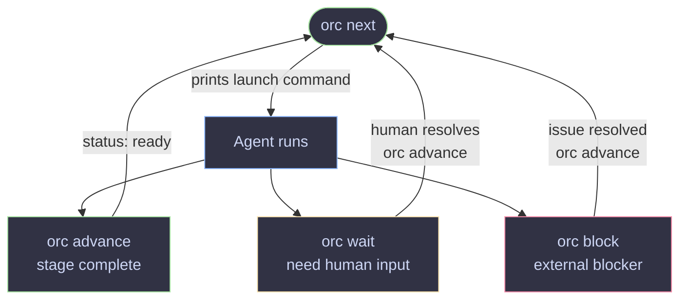

# orc

Keep feature work moving across agents, sessions, and repos — without losing context.

```
⠀⠀⠀⠀⠀⠀⠀⠀⠀⠀⠀⠀⠀⠀⢀⡀⠀⠀⠀⠀⠀⠀⠀⠀⠀⠀⠀⠀⠀⠀
⠀⠀⠀⠀⠀⠀⠀⠀⠀⠀⠀⠀⠀⢠⣿⣿⡄⠀⠀⠀⠀⠀⠀⠀⠀⠀⠀⠀⠀⠀
⠀⠀⠀⠀⠀⠀⠀⠀⠀⣀⣤⣶⣧⣄⣉⣉⣠⣼⣶⣤⣀⠀⠀⠀⠀⠀⠀⠀⠀⠀
⠀⠀⠀⠀⠀⠀⠀⢰⣿⣿⣿⣿⡿⣿⣿⣿⣿⢿⣿⣿⣿⣿⡆⠀⠀⠀⠀⠀⠀⠀
⠀⠀⠀⠀⠀⠀⠀⣼⣤⣤⣈⠙⠳⢄⣉⣋⡡⠞⠋⣁⣤⣤⣧⠀⠀⠀⠀⠀⠀⠀
⠀⢲⣶⣤⣄⡀⢀⣿⣄⠙⠿⣿⣦⣤⡿⢿⣤⣴⣿⠿⠋⣠⣿⠀⢀⣠⣤⣶⡖⠀
⠀⠀⠙⣿⠛⠇⢸⣿⣿⡟⠀⡄⢉⠉⢀⡀⠉⡉⢠⠀⢻⣿⣿⡇⠸⠛⣿⠋⠀⠀
⠀⠀⠀⠘⣷⠀⢸⡏⠻⣿⣤⣤⠂⣠⣿⣿⣄⠑⣤⣤⣿⠟⢹⡇⠀⣾⠃⠀⠀⠀
⠀⠀⠀⠀⠘⠀⢸⣿⡀⢀⠙⠻⢦⣌⣉⣉⣡⡴⠟⠋⡀⢀⣿⡇⠀⠃⠀⠀⠀⠀
⠀⠀⠀⠀⠀⠀⢸⣿⣧⠈⠛⠂⠀⠉⠛⠛⠉⠀⠐⠛⠁⣼⣿⡇⠀⠀⠀⠀⠀⠀
⠀⠀⠀⠀⠀⠀⠸⣏⠀⣤⡶⠖⠛⠋⠉⠉⠙⠛⠲⢶⣤⠀⣹⠇⠀⠀⠀⠀⠀⠀
⠀⠀⠀⠀⠀⠀⠀⠀⠀⢹⣿⣶⣿⣿⣿⣿⣿⣿⣶⣿⡏⠀⠀⠀⠀⠀⠀⠀⠀⠀
⠀⠀⠀⠀⠀⠀⠀⠀⠀⠈⠉⠉⠉⠛⠛⠛⠛⠉⠉⠉⠁⠀⠀⠀⠀⠀⠀⠀⠀⠀

orc · workspace orchestrator
```

## What it is

Agentic workflows break down at the session boundary. An agent finishes a task,
the session ends, and the next agent starts cold — no memory of what was decided,
what was built, or what still needs fixing. You end up re-explaining the same
context over and over, or the work drifts.

`orc` fixes this with a **feature folder**: a durable context pack that travels
with the ticket. Every stage reads what the previous one wrote, then writes its
own outputs into a named subfolder. Any agent — or human — can pick up mid-flight
and know exactly where things stand without asking anyone.


## Why orc?

**Context survives everything.** Session ends, agent switches, restarts — the
feature folder is the source of truth. `orc start` / `orc show --json` gives any
agent a complete picture in seconds.

**Each stage has one job and clear handoffs.** Stage docs define inputs, outputs,
exit criteria, and the exact `orc advance` command to run when done. Agents don't
decide what to do next — the workspace tells them.

**Policy lives in files, not code.** Stage docs are plain markdown. Change the
review criteria, add a preflight check, swap models — edit the file and the next
session picks it up immediately. No redeploy, no config flags.

**Right agent for each job.** A fast model for implementation, a smarter one for
review, a specialist for QA. Each worker is configured independently in a markdown
file. Use `--worker` to override for a single run.

**Human-in-the-loop where it counts.** `orc wait` creates explicit review gates.
Agents call it when they need a human decision — not at every step, and not never.
`orc advance` continues when you're ready.

**Agent-agnostic by design.** Works with Claude, Codex, or anything that can read
a file and run a shell command. No SDK dependency, no lock-in.

---

The quality of the system depends on the quality of the stage docs. A well-written
stage file has clear exit criteria, explicit output definitions, and exact commands
for every outcome. The samples are a starting point — tune them to your stack, your
review standards, and your team's process.

## Install

```bash
go install github.com/cengebretson/orc/cmd/orc@latest
```

Or build from source:

```bash
git clone git@github.com:cengebretson/orc.git
cd orc
go build -o orc ./cmd/orc/...
```

## Getting started

### 1. Scaffold a workspace

```bash
orc init
```

Run it and answer two questions: workspace path (default: current directory)
and whether to include sample workers. Or skip the prompts with flags:

```bash
orc init --workspace ~/my-workspace --with-sample-workers
```

### 2. Run setup

Let an agent configure the workspace for your ticketing system, source control,
and preferred agents:

```bash
cd ~/my-workspace
claude "Read SETUP.md and follow the setup instructions"
# or: codex "Read SETUP.md and follow the setup instructions"
```

The agent will ask about your ticket system (Jira, GitHub Issues, etc.), repos,
and which Claude/Codex model to use for each stage. It creates worker files and
updates `stages/intake.md` with the right source system instructions.

### 3. Check health

```bash
orc health
```

### 4. Start working on a ticket

```bash
orc work STORY-123
```

This creates `features/STORY-123/` and immediately prints the intake agent
launch command. Run it — the agent fetches the ticket, populates `TICKET.md`,
`SPEC.md`, and `PLAN.md`, and updates `STATE.yaml` to `status: ready`.

### 5. Continue work

```bash
orc next STORY-123
```

Launches the agent for the current stage. The agent works, updates `STATE.yaml`,
and exits. Run `orc next` again for the next stage. Use `--dry` to preview the
launch command without executing it.

## How it works

### Ticket lifecycle

```mermaid
flowchart TD
    W([orc work]) --> intake

    intake       -->|auto|        develop
    develop      -->|manual ●|    code-review
    code-review  -->|auto|        pr-open
    pr-open      -->|manual ●|    qa-automation
    pr-open      -.->|CI failures| pr-repair
    pr-repair    -->|auto|        pr-open

    qa-automation -->|auto| A([orc archive])

    style W           fill:#313244,stroke:#a6e3a1,color:#cdd6f4
    style A           fill:#313244,stroke:#a6e3a1,color:#cdd6f4
    style intake      fill:#313244,stroke:#cba6f7,color:#cdd6f4
    style develop     fill:#313244,stroke:#cba6f7,color:#cdd6f4
    style code-review fill:#313244,stroke:#cba6f7,color:#cdd6f4
    style pr-open     fill:#313244,stroke:#cba6f7,color:#cdd6f4
    style pr-repair   fill:#313244,stroke:#f38ba8,color:#cdd6f4
    style qa-automation fill:#313244,stroke:#cba6f7,color:#cdd6f4

    linkStyle 0 stroke:#a6e3a1
    linkStyle 1 stroke:#a6e3a1
    linkStyle 2 stroke:#f9e2af
    linkStyle 3 stroke:#a6e3a1
    linkStyle 4 stroke:#f9e2af
    linkStyle 5 stroke:#f38ba8,stroke-dasharray:5
    linkStyle 6 stroke:#a6e3a1
    linkStyle 7 stroke:#a6e3a1
```

`auto` — agent calls `orc advance`, next stage picks up immediately  
`manual ●` — agent calls `orc wait`; a human approves before continuing

Most teams start with a manual gate after `develop` and flip everything else to `auto`
as confidence grows. Advance mode is set per-stage in `orc.yaml`.

---

### Agent session loop



State is always written to `STATE.yaml` before the session ends — the next agent
or human picks up exactly where the last one left off.

---

## Commands

| Command | Description |
|---------|-------------|
| `orc init` | Scaffold a new workspace |
| `orc init --workspace <path>` | Scaffold at a specific path |
| `orc init --with-sample-workers` | Include sample worker files |
| `orc init --dry-run` | Preview without writing |
| `orc init --force` | Overwrite existing files |
| `orc health` | Check workspace filesystem health |
| `orc status [--json]` | Show all features and their current workflow |
| `orc work <ticket>` | Create the feature folder for a ticket — run once by the human |
| `orc work <ticket> --tmux` | Also enable tmux session for this ticket |
| `orc show <ticket> [--json]` | Show full state for one ticket |
| `orc next <ticket>` | Launch the next agent for a ticket |
| `orc next <ticket> --dry` | Preview the launch command without running it |
| `orc next <ticket> --json` | Next action as JSON for CI or scripting |
| `orc attach <ticket>` | Attach to the tmux session for a ticket |
| `orc start <ticket>` | Mark a ticket in_progress — called by agents (hidden from help) |
| `orc advance <ticket> [--stage <stage>]` | Mark current stage complete and move to the next (called by agents) |
| `orc wait <ticket> <reason>` | Mark a ticket as waiting for human input |
| `orc block <ticket> <reason>` | Mark a ticket as blocked |
| `orc archive <ticket>` | Archive a completed feature, remove worktrees |

## Workspace layout

```
my-workspace/
  AGENTS.md          shared context and routing rules (Claude + Codex)
  CLAUDE.md          imports AGENTS.md (Claude entrypoint)
  ROUTER.md          which repo owns each task, worktree paths
  TOOLS.md           approved tools, MCP servers, external systems
  RULES.md           approval, state update, and cost rules
  SETUP.md           one-time setup — run with your agent after init
  .gitignore         excludes worktrees/

  features/
    _template/       copied for each new ticket
      STATE.yaml     durable state machine for the ticket
      TICKET.md      ticket summary and acceptance criteria
      SPEC.md        context, scope, and open questions
      PLAN.md        approach and steps
      DECISIONS.md   decisions and rationale
      develop/       written by the develop stage
      code-review/   written by the code-review stage
      pr-open/       written by the pr-open stage
      qa-automation/ written by the qa-automation stage
    _archive/        completed features moved here by `orc archive`

  workers/
    _template.md     worker definition template
    intake-agent.md  fetches tickets, populates feature folder
    # add more workers per stage

  stages/
    intake.md        load ticket context — runs first for every ticket
    develop.md       implementation
    code-review.md   review implementation before opening PR
    pr-open.md       preflight checks, open PR, handoff for review
    pr-repair.md     fix CI failures, review feedback, conflicts
    qa-automation.md implement and run automated tests
    # plain markdown — no frontmatter; flow control lives in orc.yaml

  orc.yaml           workspace config — repos, paths, and purposes
  orc.yaml     named pipelines: stage sequence, worker per stage, advance mode
  ORC.md             agent state contract — read at session start

  worktrees/         git worktrees for ticket branches (gitignored)
```

## STATE.yaml

Every ticket has one. Agents update it as work progresses. `orc` reads it to
route work to the right agent.

```yaml
ticket: STORY-123
slug: STORY-123-add-login
status: in_progress
workflow: default

stage:
  owner: bob-developer
  name: develop

next_action:
  worker: bob-developer
  prompt: Implement the login feature per SPEC.md and PLAN.md.
  cwd: worktrees/my-app/STORY-123-add-login
```

## Workers

Markdown files with YAML frontmatter. The frontmatter defines who the worker is
and how to launch them. The body gives the agent behavioral guidance.

```markdown
---
id: bob-developer
name: Bob the Developer
product: codex
model: gpt-5.5
cost_tier: medium
launch_mode: foreground
---

Implements features, opens PRs, and repairs CI failures.
```

`orc.yaml` declares the default worker per stage via `worker: <id>` in each
stage entry. `orc next` looks up that worker, builds the prompt, and launches it.

Worker resolution order:
1. `--worker <id>` flag on `orc next` — one-off override (e.g. to use a more expensive model for a specific review)
2. `stage.owner` in STATE.yaml — set by a previous `orc advance --owner`
3. `worker:` for the current stage in `orc.yaml`
4. Fallback: match by `workflows:` or `stages:` list in worker frontmatter

Use `--dry` to preview the command without launching.

