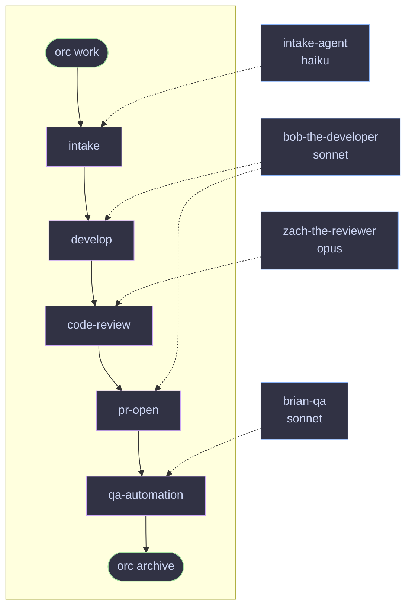
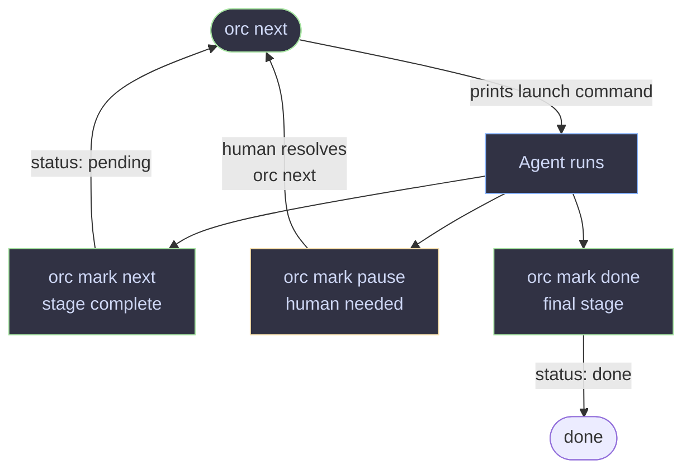

# orc

Keep feature work moving across agents, sessions, and repos — without losing context.

```
⠀⠀⠀⠀⠀⠀⠀⠀⠀⠀⠀⠀⠀⠀⢀⡀⠀⠀⠀⠀⠀⠀⠀⠀⠀⠀⠀⠀⠀⠀
⠀⠀⠀⠀⠀⠀⠀⠀⠀⠀⠀⠀⠀⢠⣿⣿⡄⠀⠀⠀⠀⠀⠀⠀⠀⠀⠀⠀⠀⠀
⠀⠀⠀⠀⠀⠀⠀⠀⠀⣀⣤⣶⣧⣄⣉⣉⣠⣼⣶⣤⣀⠀⠀⠀⠀⠀⠀⠀⠀⠀
⠀⠀⠀⠀⠀⠀⠀⢰⣿⣿⣿⣿⡿⣿⣿⣿⣿⢿⣿⣿⣿⣿⡆⠀⠀⠀⠀⠀⠀⠀
⠀⠀⠀⠀⠀⠀⠀⣼⣤⣤⣈⠙⠳⢄⣉⣋⡡⠞⠋⣁⣤⣤⣧⠀⠀⠀⠀⠀⠀⠀
⠀⢲⣶⣤⣄⡀⢀⣿⣄⠙⠿⣿⣦⣤⡿⢿⣤⣴⣿⠿⠋⣠⣿⠀⢀⣠⣤⣶⡖⠀
⠀⠀⠙⣿⠛⠇⢸⣿⣿⡟⠀⡄⢉⠉⢀⡀⠉⡉⢠⠀⢻⣿⣿⡇⠸⠛⣿⠋⠀⠀
⠀⠀⠀⠘⣷⠀⢸⡏⠻⣿⣤⣤⠂⣠⣿⣿⣄⠑⣤⣤⣿⠟⢹⡇⠀⣾⠃⠀⠀⠀
⠀⠀⠀⠀⠘⠀⢸⣿⡀⢀⠙⠻⢦⣌⣉⣉⣡⡴⠟⠋⡀⢀⣿⡇⠀⠃⠀⠀⠀⠀
⠀⠀⠀⠀⠀⠀⢸⣿⣧⠈⠛⠂⠀⠉⠛⠛⠉⠀⠐⠛⠁⣼⣿⡇⠀⠀⠀⠀⠀⠀
⠀⠀⠀⠀⠀⠀⠸⣏⠀⣤⡶⠖⠛⠋⠉⠉⠙⠛⠲⢶⣤⠀⣹⠇⠀⠀⠀⠀⠀⠀
⠀⠀⠀⠀⠀⠀⠀⠀⠀⢹⣿⣶⣿⣿⣿⣿⣿⣿⣶⣿⡏⠀⠀⠀⠀⠀⠀⠀⠀⠀
⠀⠀⠀⠀⠀⠀⠀⠀⠀⠈⠉⠉⠉⠛⠛⠛⠛⠉⠉⠉⠁⠀⠀⠀⠀⠀⠀⠀⠀⠀

orc · workspace orchestrator
```

## What it is

Agentic workflows break down at the session boundary. An agent finishes a task,
the session ends, and the next agent starts cold — no memory of what was decided,
what was built, or what still needs fixing. You end up re-explaining the same
context over and over, or the work drifts.

`orc` fixes this with a **feature folder**: a durable context pack that travels
with the ticket. Every stage reads what the previous one wrote, then writes its
own outputs into a named subfolder. Any agent — or human — can pick up mid-flight
and know exactly where things stand without asking anyone.

```mermaid
flowchart LR
    IN([intake])       -->|"TICKET.md · SPEC.md · PLAN.md"| DE
    DE([develop])      -->|"develop/HANDOFF.md"| CR
    CR([code-review])  -->|"code-review/REVIEW.md"| PO
    PO([pr-open])      -->|"pr-open/PR.md"| QA
    QA([qa-automation])--> AR([archived])

    style IN  fill:#313244,stroke:#cba6f7,color:#cdd6f4
    style DE  fill:#313244,stroke:#cba6f7,color:#cdd6f4
    style CR  fill:#313244,stroke:#cba6f7,color:#cdd6f4
    style PO  fill:#313244,stroke:#cba6f7,color:#cdd6f4
    style QA  fill:#313244,stroke:#cba6f7,color:#cdd6f4
    style AR  fill:#313244,stroke:#a6e3a1,color:#cdd6f4
```



## Why orc?

**Context survives everything.** Session ends, agent switches, restarts — the
feature folder is the source of truth. `orc next <ticket>` / `orc status <ticket> --json` gives any
agent a complete picture in seconds.

**Each stage has one job and clear handoffs.** Stage docs define inputs, outputs,
exit criteria, and the exact `orc mark <ticket> next` command to run when done. Agents don't
decide what to do next — the workspace tells them.

**Policy lives in files, not code.** Stage docs are plain markdown, and
`orc.yaml` declares the stage order, default worker, and advance mode. Change the
review criteria, add a preflight check, swap models — edit the file and the next
session picks it up immediately.

**Right agent for each job.** A fast model for implementation, a smarter one for
review, a specialist for QA. Each worker is configured independently in a markdown
file. Use `--worker` to override for a single run.

**Human-in-the-loop where it counts.** `orc mark <ticket> pause` creates explicit review gates.
Agents call it when they need a human decision — not at every step, and not never.
`orc mark <ticket> next` continues when you're ready.

**Agent-agnostic by design.** Works with Claude, Codex, or anything that can read
a file and run a shell command. No SDK dependency, no lock-in.

---

The quality of the system depends on the quality of the stage docs. A well-written
stage file has clear exit criteria, explicit output definitions, and exact commands
for every outcome. The samples are a starting point — tune them to your stack, your
review standards, and your team's process.

## Install

```bash
go install github.com/cengebretson/orc/cmd/orc@latest
```

Or build from source:

```bash
git clone git@github.com:cengebretson/orc.git
cd orc
go build -o orc ./cmd/orc/...
```

## Getting started

### 1. Scaffold a workspace

```bash
orc init
```

Run it and answer two questions: workspace path (default: current directory)
and whether to include sample workers. Or skip the prompts with flags:

```bash
orc init --workspace ~/my-workspace --with-sample-workers
```

### 2. Run setup

Let an agent configure the workspace for your ticketing system, source control,
and preferred agents:

```bash
cd ~/my-workspace
claude "Read SETUP.md and follow the setup instructions"
# or: codex "Read SETUP.md and follow the setup instructions"
```

The agent will ask about your ticket system (Jira, GitHub Issues, etc.), repos,
and which Claude/Codex model to use for each stage. It creates worker files and
updates `ROUTER.md` with the right ticket system retrieval instructions.

### 3. Check health

```bash
orc health
```

### 4. Start working on a ticket

```bash
orc work STORY-123
```

This creates `features/STORY-123/` and immediately prints the intake agent
launch command. Run it — the agent fetches the ticket, populates `TICKET.md`,
`SPEC.md`, and `PLAN.md`, and updates `STATE.yaml` to `status: ready`.

### 5. Continue work

```bash
orc next STORY-123
```

Launches the agent for the current stage. The agent works, updates `STATE.yaml`,
and exits. Run `orc next` again for the next stage. Use `--dry` to preview the
launch command without executing it.

You can also use the dashboard:

```bash
orc tui
```

## Example workflow

### Stages and workers

`features/STORY-123/` is the durable handoff between agents — each writes state when done, the next picks up from the same folder. Different stages can use different workers and models.



CI failures loop back through a `pr-repair` stage (also `bob-the-developer`) before returning to `pr-open`.

Workers are markdown files in `workers/`. Each stage in `orc.yaml` names a worker — mix models and agents freely. Use `--worker` to override for a single run.

`auto` — agent calls `orc mark <ticket> next`, next stage picks up immediately  
`manual` — agent calls `orc mark <ticket> pause`; a human approves before continuing

---

### Agent session loop



State is always written to `STATE.yaml` before the session ends — the next agent
or human picks up exactly where the last one left off.

---

## Commands

### Human commands

| Command | Description |
|---------|-------------|
| `orc init` | Scaffold a new workspace |
| `orc init --workspace <path>` | Scaffold at a specific path |
| `orc init --with-sample-workers` | Include sample worker files |
| `orc init --dry-run` | Preview without writing |
| `orc init --force` | Overwrite existing files |
| `orc health` | Check workspace filesystem health |
| `orc health <ticket>` | Validate a ticket's state — checks workflow, stage, worker, worktrees |
| `orc status` | Show all features and their current workflow/stage |
| `orc status [--json]` | Output the list as JSON |
| `orc status <ticket>` | Show full details for a specific ticket |
| `orc status <ticket> --json` | Full ticket details as JSON |
| `orc work <ticket>` | Create the feature folder for a ticket |
| `orc work <ticket> --workflow <name>` | Use a named workflow instead of the configured default |
| `orc work <ticket> --tmux` | Also enable tmux session for this ticket |
| `orc work <ticket> --next` | Create the feature folder and immediately launch the first stage |
| `orc next <ticket>` | Launch the next agent for a ticket |
| `orc next <ticket> --dry` | Preview the launch command without running it |
| `orc next <ticket> --json` | Next action as JSON for CI or scripting |
| `orc next <ticket> --worker <id>` | Override the selected worker for one launch |
| `orc attach <ticket>` | Attach to the tmux session for a ticket |
| `orc archive <ticket>` | Archive a completed feature, remove worktrees |
| `orc tui` | Open the interactive dashboard |

### Agent commands

These are called by agents at the end of each session. They are hidden from `orc --help` but visible via `orc help-all`.

| Command | Description |
|---------|-------------|
| `orc mark <ticket> next` | Mark the current stage complete and move to the next (`done` if no stages remain) |
| `orc mark <ticket> next --stage <name>` | Jump to a specific stage (e.g. send back to develop after review) |
| `orc mark <ticket> next --worker <id>` | Override the worker for the next stage |
| `orc mark <ticket> next --result "<summary>"` | Record what was done in history |
| `orc mark <ticket> pause "<reason>"` | Pause for human — input, approval, or external blocker |
| `orc mark <ticket> done` | Mark a ticket as done — force-close at any point |

## Workspace layout

```
my-workspace/
  AGENTS.md          shared context and routing rules (Claude + Codex)
  CLAUDE.md          imports AGENTS.md (Claude entrypoint)
  ROUTER.md          which repo owns each task, worktree paths
  TOOLS.md           approved tools, MCP servers, external systems
  RULES.md           approval, state update, and cost rules
  SETUP.md           one-time setup — run with your agent after init
  .gitignore         excludes worktrees/

  features/
    _template/       copied for each new ticket
      STATE.yaml     durable state machine for the ticket
      TICKET.md      ticket summary and acceptance criteria
      SPEC.md        context, scope, and open questions
      PLAN.md        approach and steps
      DECISIONS.md   decisions and rationale
      # stage subfolders such as develop/, code-review/, and pr-open/
      # are created by agents when those stages write outputs
    _archive/        completed features moved here by `orc archive`

  workers/
    _template.md     worker definition template
    intake-agent.md  fetches tickets, populates feature folder
    # add more workers per stage

  stages/
    intake.md        load ticket context — runs first for every ticket
    develop.md       implementation
    code-review.md   review implementation before opening PR
    pr-open.md       preflight checks, open PR, handoff for review
    pr-repair.md     fix CI failures, review feedback, conflicts
    qa-automation.md implement and run automated tests
    # plain markdown — no frontmatter; flow control lives in orc.yaml

  orc.yaml           workspace config — repos, workflows, repair stages, settings
  ORC.md             agent state contract — read at session start

  worktrees/         git worktrees for ticket branches (gitignored)
```

## orc.yaml

`orc.yaml` is the workspace config. It declares repos, named workflows, repair
stages, and optional settings.

```yaml
settings:
  default_workflow: default
  auto_archive: false
  auto_tmux: false       # wrap every orc next launch in a tmux session automatically
  auto_next: false       # orc work immediately launches the first stage (same as --next)
  tui_refresh: 60        # dashboard auto-refresh interval in seconds
  theme: catppuccin-mocha

repos:
  - name: my-app
    path: ../my-app
    purpose: Application code, APIs, tests

workflows:
  default:
    stages:
      - name: intake
        worker: fred-documentor
        advance: auto
      - name: develop
        worker: bob-developer
        advance: manual
      - name: code-review
        worker: bob-developer
        advance: auto
      - name: pr-open
        worker: bob-developer
        advance: manual
      - name: qa-automation
        worker: brian-qa
        advance: auto

repair_stages:
  pr-repair:
    repairs: pr-open
    worker: bob-developer
    advance: auto
    max_retries: 3
```

`default_workflow` is used by `orc work <ticket>` when `--workflow` is omitted.
If it is not set, `orc work` returns an error. `advance: auto` tells agents to
run `orc mark <ticket> next` when a stage is complete; `advance: manual` tells agents to
run `orc mark <ticket> pause` so a human can review before continuing.

## STATE.yaml

Every ticket has one. Agents update it as work progresses. `orc` reads it to
route work to the right agent.

```yaml
ticket: STORY-123
slug: STORY-123-add-login
status: active
workflow: default

stage:
  worker: bob-developer
  name: develop

next_action:
  worker: bob-developer
  prompt: Implement the login feature per SPEC.md and PLAN.md.
  cwd: worktrees/my-app/STORY-123-add-login

history:
  - at: "2026-05-28 09:00"
    stage: intake
    worker: fred-documentor
    result: ticket context loaded, SPEC.md and PLAN.md written
  - at: "2026-05-29 14:22"
    stage: develop
    worker: bob-developer
    result: paused — need product decision on refresh token TTL
  - at: "2026-05-30 09:10"
    stage: develop
    worker: bob-developer
    result: resumed after human clarified TTL should be 7 days
```

### Status values

| Status | Meaning | Set by |
|--------|---------|--------|
| `pending` | Feature created, intake not yet run | `orc work` |
| `ready` | Stage complete, queued for next agent | `orc mark <ticket> next` |
| `active` | Agent is actively working | `orc mark <ticket> start` |
| `paused` | Human needed — input, approval, or external blocker | `orc mark <ticket> pause` |
| `done` | All stages complete, or explicitly closed | `orc mark <ticket> next` (final stage) or `orc mark <ticket> done` |
| `archived` | Feature folder moved to `_archive/` | `orc archive` |

## Workers

Markdown files with YAML frontmatter. The frontmatter defines who the worker is
and how to launch them. The body gives the agent behavioral guidance.

```markdown
---
id: bob-developer
name: Bob the Developer
engine: codex
model: gpt-5.5
args:
  reasoning_effort: high
  service_tier: medium
---

Implements features, opens PRs, and repairs CI failures.
```

`orc.yaml` declares the default worker per stage via `worker: <id>` in each
stage entry. `orc next` looks up that worker, builds the prompt, and launches it.

Worker resolution order:
1. `--worker <id>` flag on `orc next` — one-off override (e.g. to use a more expensive model for a specific review)
2. `stage.worker` in STATE.yaml — set by a previous `orc mark <ticket> next --worker`
3. `worker:` for the current stage in `orc.yaml`

If no worker is found at any step, `orc next` exits with a clear error pointing to `orc.yaml`.

Use `--dry` to preview the command without launching.
